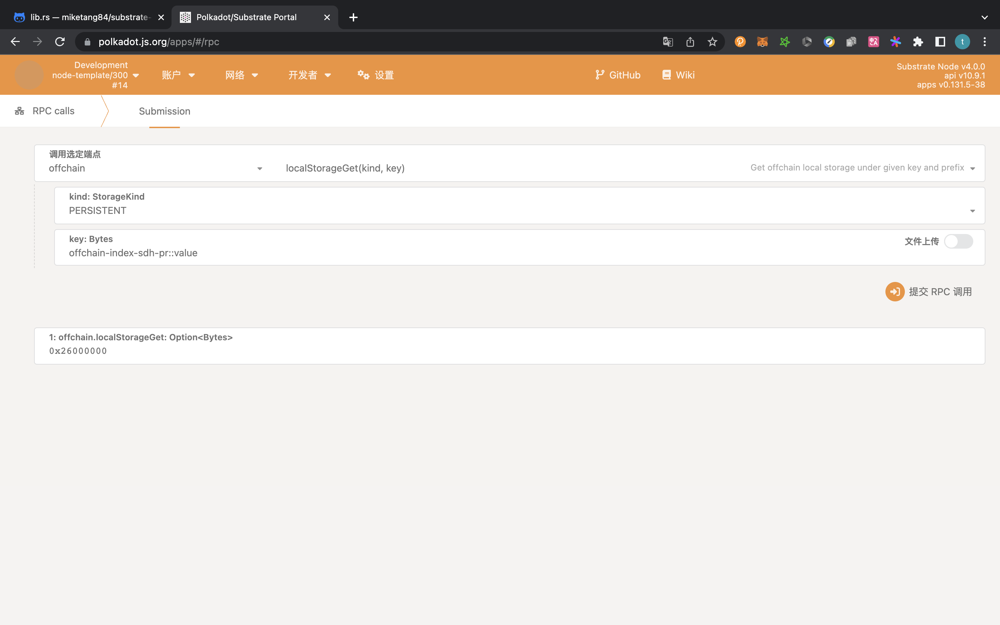
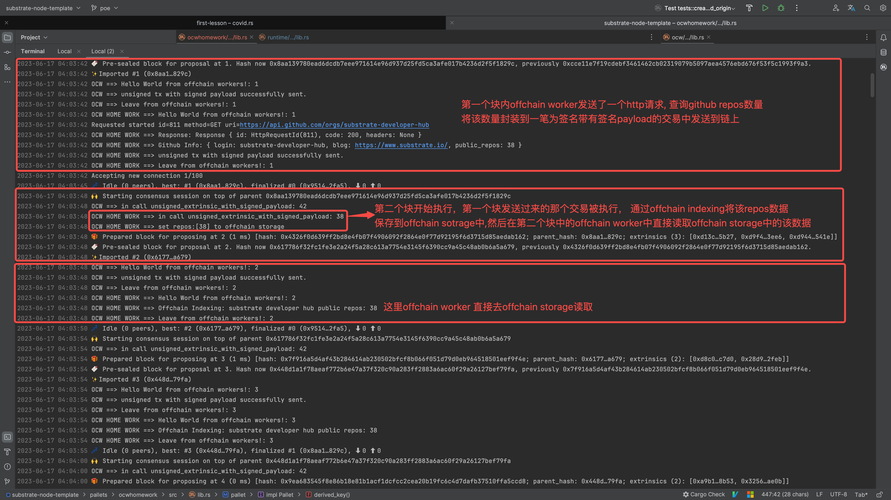

# 老师，offchain worker作业看这里！

> 代码在ocwhomework的lib.rs里

### 作业运行截图在这里

作业要求：

- 在Offchain Worker中，使用Offchain Indexing特性实现从链上向Offchain Storage中写入数据
- 使用 js sdk 从浏览器frontend获取到前面写入Offchain Storage的数据
- 设计一个场景实例（比如获取一个外部的价格信息），实现从OCW中向链上发起带签名负载的不签名交易，并在Runtime中正确处理

我的作业实现：

在第1个和第5的倍数的块的offchain worker里发送http请求查询github 账户的公开的repos数量，然后发送一个不签名带有签名交易的请求到链上，在下一个块中该请求被执行，执行逻辑是将该repos通过offchain indexing写入offchain storage中。

然后在其他的块的offchain worker里直接读取offchain storage并打印该数据。

并且通过polkadot.js直接查询offchain storage来查询我们保存的数据。

至此全部覆盖了作业要求，截图如下：

Polkadot.js查询截图：

运行日志截图：

